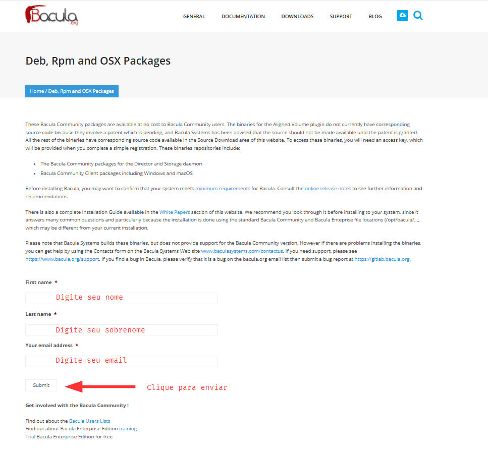
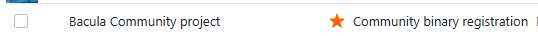
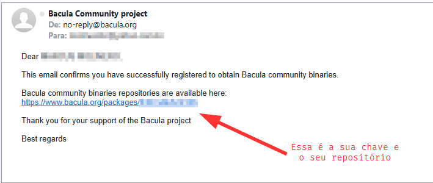
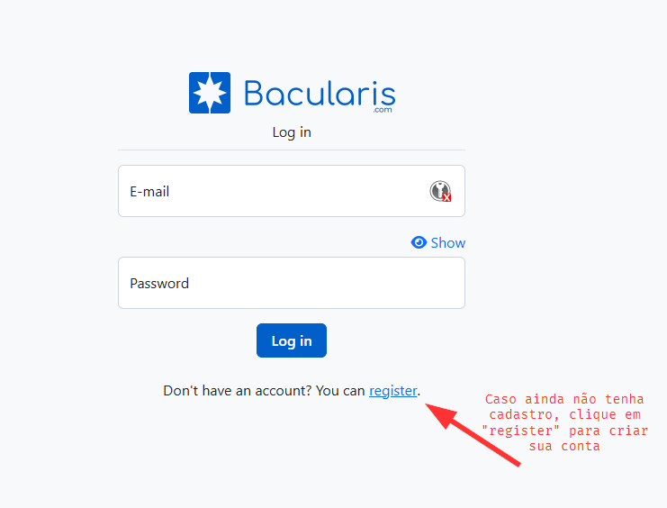
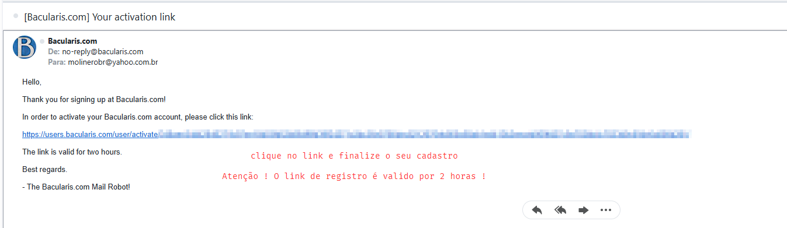

# 
 Bem vindo ao curso **Bacula Professional** 

Antes de iniciarmos o nosso curso, é necessário prepararmos o nosso ambiente e resolver os pré-requisitos

Para instalar o Bacula Community e/ou Bacularis, você precisa criar uma conta em [bacula.org](https://www.bacula.org/bacula-binary-package-download/) and [bacularis.app](https://users.bacularis.com/user/login/) previamente para obter sua chave/conta/senha.

!!! attention Utilize um email válido e não se esqueça de verificar sua caixa de spam, caso não encontre o email enviado com sua chave

Acesse o site de registro do Bacula Community em: https://www.bacula.org/bacula-binary-package-download/ e efetue seu cadastro

Você receberá uma mensagem no email cadastrado, do remetente **Bacula Community project**

!!! note Não precisa baixar os pacotes e executar a instalação, pois faremos durante a aula !

Agora acesse o site de registro do Bacularis em: https://users.bacularis.com/user/login/ para também fazer o cadastro e obter sua chave/repositório

Após efetuar o registro, você receberá no email cadastrado, as informações do seu repositório

!!! note Assim como no cadastro do Bacula, não é necessário fazer mais nada, pois faremos a instalação durante a aula

Então é isso pessoal ! Caso tenham dúvidas, não hesitem em nos procurar pelos canais de suporte

email: treinamento@nomaland.com.br
Grupo do Telegram: [Bacula Professional](https://t.me/+SdUhREtsN1Y3ZjU5)
WhatsApp: (21) 98014-6658

 
 
 

NOMALAND Tecnologia - Todos os direitos reservados © - www.nomaland.com.br

</center